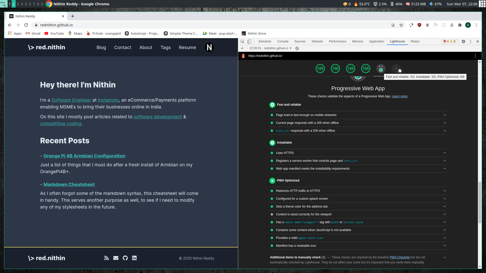
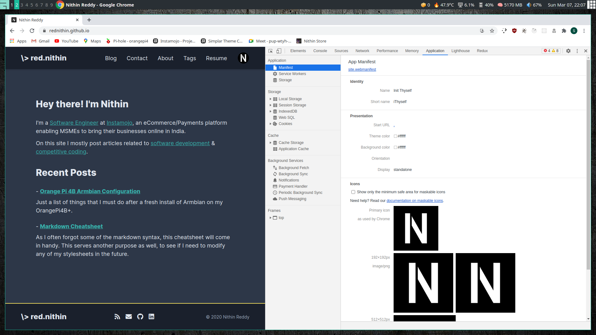

+++
title = "Easiest way to turn a static website into a PWA"
description = "Easiest way to turn a static website into a PWA"
template = "page.html"
date = 2021-03-07
[taxonomies]
tags = ["pwa", "workbox", "web"]
+++

What's the easiest way to turn a static website into a PWA? Let's find out.

<!-- more -->

- [What is a PWA?](#what-is-a-pwa)
- [Service Worker](#service-worker)
- [Sample Manifest file](#sample-manifest-file)
- [Some Meta And Link Tags](#some-meta-and-link-tags)
- [Debugging Issues](#debugging-issues)
- [Conclusion](#conclusion)

# What is a PWA?

To put it in simple terms it's a web app that behaves like a native app on a respective platform like Linux, Android, etc.
PWA generally consists of 2 main things.

- Service Worker
- Web App Manifest file
- Status Bar, Apple Touch Icon & Viewport

# Service Worker

So if you want to create a service worker which caches your entire static website for offline use and also does runtime caching.
It will be a ton of work.
 - You will need to learn about `lifecycle` events. 
 - If it is safe to upgrade the serviceWorker. 
 - Clearing old caches 

...and the list goes on.

Instead of rolling out our custom logic which frankly takes a lot of time to get right.
We can go with [workbox](https://developers.google.com/web/tools/workbox).
Workbox is a library that does all of the above and all we need to do is declaratively specify what we want.

```javascript, hl_lines=7 9 11 16 19 31 34
const workboxBuild = require('workbox-build');

// NOTE: This should be run *AFTER* all your assets are built
const buildSW = () => {
  // This will return a Promise
  return workboxBuild.generateSW({
    globDirectory: 'public',
    globPatterns: [
      '**/*.{html,json,js,css}',
    ],
    swDest: 'public/sw.js',

    // Define runtime caching rules.
    runtimeCaching: [{
      // Match any request that ends with .png, .jpg, .jpeg or .svg.
      urlPattern: /\.(?:png|jpg|jpeg|svg)$/,

      // Apply a stale-while-revalidate strategy.
      handler: 'StaleWhileRevalidate',

      options: {
        // Use a custom cache name.
        cacheName: 'images',

        // Only cache 10 images.
        expiration: {
          maxEntries: 20,
        },
      },
    },{
      urlPattern: /\.(?:woff|woff2|ttf|eot)$/,

      // Apply a cache-first strategy.
      handler: 'CacheFirst',

      options: {
        // Use a custom cache name.
        cacheName: 'fonts',

        // Only cache 20 fonts.
        expiration: {
          maxEntries: 20,
          maxAgeSeconds: 7* 24 * 60 * 60
        },
      },
    }
  ],
  });
};

buildSW();
```

The above code generates a service worker file with `pre-caching` and `runtime caching`

Pre-caching is downloading all the files ahead of time so all of them are served from the cache whenever we request a specific page or asset. Pre-caching is usually done right after your website loads. This is how we can make our app truly offline because we will download the entire website on the initial load. (Point to note that pre-caching happens after your initial page load is done. So it doesn't affect your website initial load times/render times). `globPatterns` determines what files will be pre-cached.

Runtime caching is caching on the fly. In the above example, you can see that I am caching all the images/fonts using runtime caching. That is as soon as a request for an image/font happens it will also be cached at that point, so from next time onwards it will be fetched from the cache. 

Also, a thing to keep in mind is the various strategies workbox provides.

For images I have used `StaleWhileRevalidate` strategy which serves the image from cache then checks/updates the image to be up-to-date.

As for the fonts I have used `CacheFirst` strategy which serves it from the cache if it exists otherwise it fetches it from the network. CacheFirst strategy makes sense for fonts they don't change.


# Sample Manifest file

```json, hl_lines=19
{
  "name":"Init Thyself",
  "short_name":"iThyself",
  "icons":[
    {
      "src":"/images/android-chrome-192x192.png",
      "sizes":"192x192",
      "type":"image/png"
    },
    {
      "src":"/images/android-chrome-512x512.png",
      "sizes":"512x512",
      "type":"image/png"
    },
    {
      "src": "/images/maskable_icon.png",
      "sizes": "192x192",
      "type": "image/png",
      "purpose": "any maskable"
    }
  ],
  "start_url": ".",
  "theme_color":"#ffffff",
  "background_color":"#ffffff",
  "display":"standalone"
}
```

So the main thing you will notice is that you will need icons.
For my blog, the icons are generated from [favicon.io](https://favicon.io/).

This website will give your logo in multiple formats and sizes which you can use directly.

If you notice along with the icons we also need something known as a `maskable icon`.
It's an icon that can be dynamically modified to ovals, square, rounded squares, etc by an icon pack on Android to make it feel familiar with the theme.

You can easily convert any icon into a maskable icon from here [maskable.app](https://maskable.app/)


# Some Meta And Link Tags

```html
<head>
  ...
  <!-- Viewport -->
  <meta
    name="viewport"
    content="width=device-width, initial-scale=1.0, maximum-scale=5.0"
  />

  <!-- Icons -->
  <link
    rel="icon"
    type="image/png"
    sizes="32x32"
    href="/images/favicon-32x32.png"
  />
  <link
    rel="icon"
    type="image/png"
    sizes="16x16"
    href="/images/favicon-16x16.png"
  />
  <link rel="shortcut icon" href="/images/favicon.ico" />
  <link rel="apple-touch-icon" href="/images/apple-touch-icon.png"/>

  <!-- Theme Color -->
  <meta name="theme-color" content="#1a202c">

  <!-- Load Manifest -->
  <link rel="manifest" href="/site.webmanifest" />
  ...
</head>
<body>
...
  <script>
    if ('serviceWorker' in navigator) {
      navigator.serviceWorker.register('/sw.js');
    }
  </script>
...
</body>
```

`Viewport` is the area visible to the user. We use the `meta[name=viewport]` tag to configure it.

`Theme Color` is used as the background for status bars in mobile. We use the `meta[name=theme-color]` tag to configure it.

We also need to set the `apple-touch-icon` so the app behaves well on iOS.

And lastly, we will need to load up the `manifest` file & `serviceWorker` files.


# Debugging Issues

I highly recommend anyone doing web development benchmark their websites using the Lighthouse functionality in Chrome DevTools.



To check if your manifest contains any errors you will need to navigate to `Application > Manifest` in Chrome DevTools.



# Conclusion

With the above instructions, your static website will become a PWA in no time.